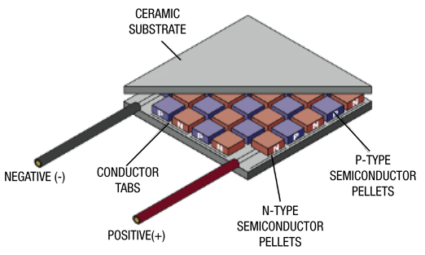

# MicroChallenge
MicroChallenge-ThermoElectricGeneratorManujaFlora

Hi, it's Manuja and Flora.

Content:
1. What is a thermo electric generator aka. peltier aka. TEG?
  - A thermoelectric generator is a device that converts heat energy directly into electrical energy through the Seebeck effect. This effect occurs when a temperature difference is applied across a semiconductor material, causing a voltage difference and thus generating electricity. Thermoelectric generators are often used in situations where there's a temperature gradient available, such as in waste heat recovery, portable power generation, or spacecraft. They offer advantages like reliability, silent operation, and suitability for small-scale applications.

   
2. How can we use a TEG to produce electricity
   - This seemed like an interesting electrical component for us as it converted the difference in temeperatures to generate electricity. We used a somewhat stable heat source at the bottom plate and connected it directly with a multimeter to see how many volts it can generate with temperature differences.
   - Our very first test was with the sandwich grill machine in class, the highest temperature the  machine goes to is about 100° Celcius, which produces the highest voltage of about 1.70V, which just about enough to power a red LED bulb. We now knew that we needed more TEGs if we wanted to store electricity in a battery.
    - We asked the sweet Adai for more TEGs, in order to connect them all together, provide the same heat source to all three TEGs to generate a larger voltage. However, when we connected the three TEGs in series, gave it a stable heat source, the voltage produced was still the same - 1.7V. Even after countless tests, changing the temperature difference with an ice pack and literal fire, the voltage that the three TEGs producing together was still only around 1.7V. We need more time to test the TEGs in serie to see if we could potentially get the voltage higher, as seen on experimental videos.

       

Content:
1. What is a thermo electric generator aka. peltier aka. teg?
2. How can we use it to produce electricity?
4. How much electricity? Going from 1.7V more or less 100 degrees / 2.4V 130 degrees / 5V 200 degrees
5. What can you do with different numbers of devices, potentially?
6. In which way?
7. Sources of heat?
8. !Be careful!
9. What can we do with this electrcity?
10. Can we store it?
11. Is it an effective way of capturing lost heat from devices?
12. The future with this?
13. Process

 Outcome with two tegs:
 Outcome with three tegs:

Physical visual powered by energy harvested from thermo electric generator lol
What you need:
Step 1: Battery
Step 2: Led light
Step 3: tube
Step 4: Led light
Step 5: cables
Step 6: sign to be projected on wall 3D printed

Useful links 
[Link to spreadsheet](https://docs.google.com/spreadsheets/d/1xx-vDogvFZxxWVkE16zlOU1NbrjYh_qj2Mj9RpacV5w/edit#gid=0)

[Link to MDEF website](https://fablabbcn-projects.gitlab.io/learning/educational-docs/challenge/c_1/)
