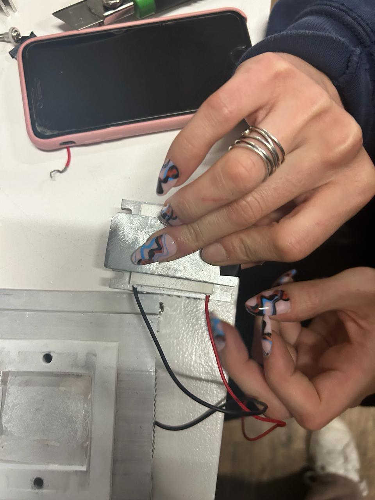
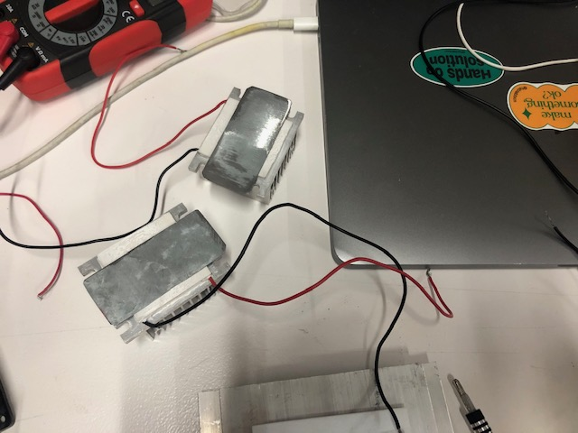

# MicroChallenge
MicroChallenge-ThermoElectricGeneratorManujaFlora

Hi, it's Manuja and Flora.
We initally began brainstorming with our individual interests to sort out our project aim. Manuja's interests lie in biomaterials, solar energy and generating electricity through unconventional electronics. FLora's interests lie in exploring with electronics, human and non-human collaborations and diffusion of knowledge. Once we brainstormed a few ideas, we landed on the concept of wanting to generate electricity using any type of waste heat. After multiple discussions and brainstorming ideas, we know our purpose statement - How might we develop an installation that effectively utilises the difference in heat energy or uses waste heat energy to drive an interactive digital visualisation. Please keep reading to see how we managed to fail multiple times without even realising that we succeeded in one of those failures.

1. What is a thermo electric generator aka. peltier aka. TEG?
   - A thermoelectric generator is a device that converts heat energy directly into electrical energy through the Seebeck effect. This effect occurs when a temperature difference is applied across a semiconductor material, causing a voltage difference and thus generating electricity. Thermoelectric generators are often used in situations where there's a temperature gradient available, such as in waste heat recovery, portable power generation, or spacecraft. They offer advantages like reliability, silent operation, and suitability for small-scale applications. 

2. How can we use a TEG to produce electricity (1.7V more or less 100 degrees / 2.4V 130 degrees / 5V 200 degrees)
  - This seemed like an interesting electrical component for us as it converted the difference in temeperatures to generate electricity. We used a somewhat stable heat source at the bottom plate and connected it directly with a multimeter to see how many volts it can generate with temperature differences.
   - First question. Could it be possible to produce electricity with our body heat? How hot does the source of heat have to be? We placed one TEG on our skin for about 30 min, using the multimeter we saw that it produced very low voltage such as 0.06 V. Would you need to cover your whole body in TEGS to produce 1 V? This could maybe be interesting in the context of self regenerating energy wearables in the future.
   - Our very first test was with the sandwich grill machine in class, the highest temperature the  machine goes to is about 100° Celcius, which produces the highest voltage of about 1.70V, which just about enough to power a red LED bulb. We now knew that we needed more TEGs if we wanted to store electricity in a battery.
    - We asked the sweet Adai for more TEGs, in order to connect them all together, provide the same heat source to all three TEGs to generate a larger voltage. However, when we connected the three TEGs in series, gave it a stable heat source, the voltage produced was still the same - 1.7V. Even after countless tests, changing the temperature difference with an ice pack and literal fire, the voltage that the three TEGs producing together was still only around 1.7V. We need more time to test the TEGs in serie to see if we could potentially get the voltage higher, as seen on experimental videos.
    - We then asked ourselves what could happen if we changed the heat source and cold source. We tried with several heat sources: boiling water, heating pad, candles,soldering iron, cooking stove and ice. 
    Boiling water/heating pad and ice pack: producing very low energy
    Candle and ice pack:producing very low energy
    Soldering iron at 200 degrees: 5V coming in
    Cooking stove: around 150 degrees 3V

    

Testing the storage of energy with a rechargeable battery INR18650 lithium-ion and a 18650 battery shield:
- Specifications of 18650 battery shield:
 
 - Micro Usb port input
 - USB output
 - Led indication
 - !Be careful with the cables! Don't create a short circuit!

Range of battery:
- Current in A: 2.75 A to 5.5 A
- Electrical voltage in V: 3.65V to 4.2V

From that we understood that if we stayed in between a range of 3.6 V and 4.2V at 150 degrees (stabilised), if the battery was not completely uncharged, for about 10 minutes, we could recharge it of +- 0.15 Volts. We think. Needs more testing to be 100% sure.

Initial battery Voltage with multimeter: 3.5V
Initial battery Voltage with multimeter after charging: 3.65V

Trying the TEG device with different materials for less heat difusion:
The devices we received from Adai either were completely bare or all had different components added to the device:

- The first TEG we received was screwed to a metal heatsink and a fan on the cold side, and on the hot side a metal plate. We decided to not power the fan in our tests. When using a heatsink on the cold side, a metal plate on hot side and a 150 degrees heat source, we managed to produce 3volts, for 30 seconds. The heatsink heats up but not very fast.
- The second one we received was completely bare, therefore it was quite hard to control he difference of temperature on both side. We didn't get a lot of results.(this one was damaged and the + wire broke during testing)
- The two last were both connected to a smaller heatsink on the cold side, additionally we cut a thin layer of metal for the warm side. The results were not very good. we need more time to prototype a correct conductor for the warm side. We also had to be very careful with the cables of the TEG when using such high heat.

It would be also interesting to test we different conductive materials and isolators to see if the results can be enhanced.

 Outcome with two tegs:
 Outcome with three tegs:

Physical visual powered by energy harvested from thermo electric generator lol
What you need:
- Step 1: Battery
- Step 2: Led light
- Step 3: tube
- Step 4: Led light
- Step 5: cables
- Step 6: sign to be projected on wall 3D printed
 

Our Learnings:
ELECTRONIC DEVICES ARE NO JOKE!!
- To be super careful and not burn ourselves 3 times
- We learned how to charge a battery and store electricity in it
- We learned how to discharge a battery
- We learned how to keep a stable heat source temperature 
- We learned the difference between charging voltage, nominal voltage, charging current and how to calculate the charging time. 
- We learned a lot of electrical physics 

The Future:
- This initial stepping stone of this project has a lot of potential. Experimenting with a TEG and being able to store electricity in a battery is not revolutionary, but if given more time, there are countless variations that we want to try. 
- We would like to generate electricity using body heat, biomaterials, the sun, waste heat and many more different types of sustainable sources. 
- We would also like to combine more electronic devices like the super sonic sensor to be able to visually change the display of the installation.

References: 
- [FlexibleThermoelecrticModule](https://phys.org/news/2018-12-flexible-thermoelectric-module-silver-bullet.html)
- [Thermo-electric Battery Charger](https://www.instructables.com/Thermo-electric-Battery-Charger/)
- [Potential applications of thermoelectric generators (TEGs) in various waste heat recovery systems](https://www.sciencedirect.com/science/article/pii/S2666202722001124)

Useful links 
[Link to spreadsheet](https://docs.google.com/spreadsheets/d/1xx-vDogvFZxxWVkE16zlOU1NbrjYh_qj2Mj9RpacV5w/edit#gid=0)

[Link to MDEF website](https://fablabbcn-projects.gitlab.io/learning/educational-docs/challenge/c_1/)
